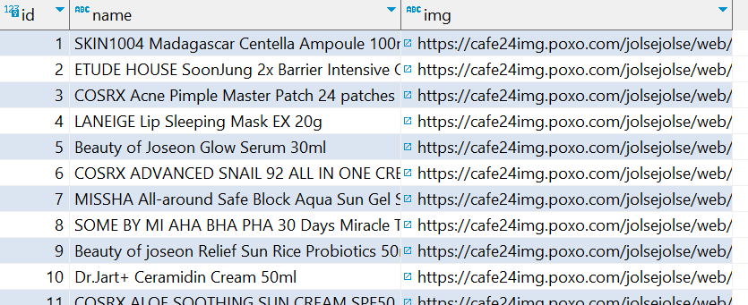
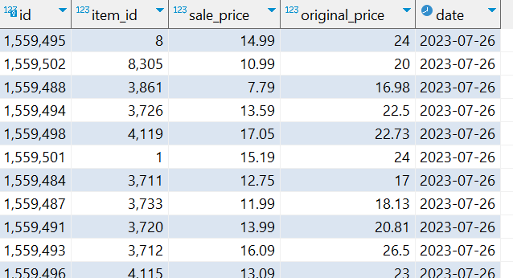
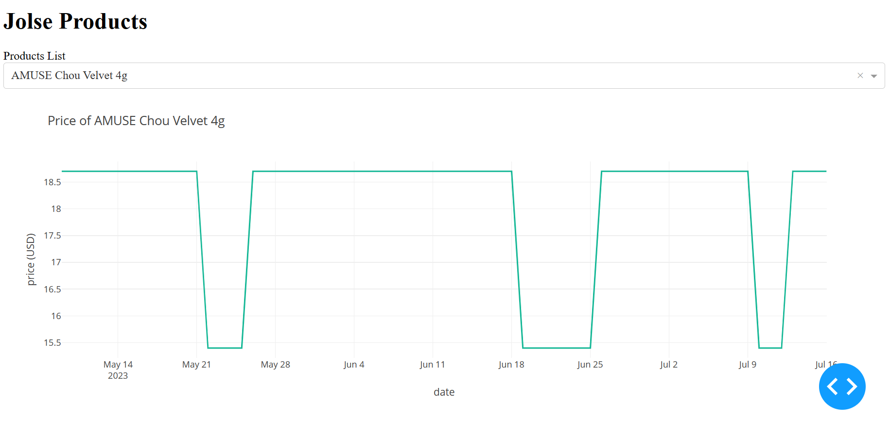

# Jolse Products Prices Pipeline and Tracker

This project contains a ETL pipeline that uses Scrapy to scrape all the products from https://jolse.com/ into a PostgreSQL database hosted on GCP's Cloud SQL. And a tracker that visually displays the price history of each product using Dash.

## Pipeline
The pipeline uses XPath to identify and extract the product and price data we want and then loads it into the tables after doing any transformations if needed etc. if sale price is missing, it would default to the original pricing

### Tables
Product Table (Contains a unique product along with the image url):

Price Table (Contains the days current sale price and original price of the product - item_id as a foreign key referencing the Products table)

The pipeline is currently deployed to Cloud Functions as an HTTP trigger and is scheduled to run once every day using Cloud Scheduler by calling that trigger.
There are two other scheduled jobs that will turn the sql instance on and off to reduce costs when the pipeline isn't running (takes about 15mins)

## Price Tracker
Website (not deployed) built using Dash that has the ability to search for a product and view the price history of it by querying the data from the tables:

